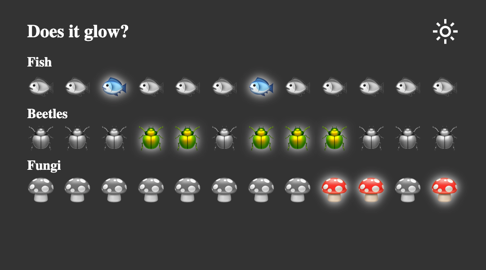

# Does It Glow?

One very common use case for **context** is theming! If your app lets a user change its
appearance (e.g. dark mode), that theme information can be kept in context so that
components anywhere can quickly access it to adjust their visual appearance.

This is a _pair-programming_ exercise, so designate one person in your group to be the
initial Driver.

## Create and provide theme context

In a new file named `ThemeContext.jsx`:

1. Create a new context named `ThemeContext`.
2. Export `ThemeProvider`, which provides three values to its children:
   - `isDark` is a boolean state variable with an initial value of `false`
   - `theme` is `"dark"` if it `isDark`; otherwise it is `"light"`
   - `toggleTheme` is a function that sets `isDark` to the opposite value when called
3. Export a custom hook named `useTheme`, which subscribes to `ThemeContext` if possible.
   It throws an Error if called outside `ThemeProvider` (i.e. `useContext` returns null).
4. Provide the newly created context to your app by wrapping it with `<ThemeProvider/>` in
   `main.jsx`.
5. Use the [React Developer Tools](https://react.dev/learn/react-developer-tools) to
   confirm that `isDark`, `theme`, and `toggleTheme` are correctly provided to your `App`
   by checking the `Context.Provider` component in the **Components** tab.

Once you've confirmed that the correct context values are being provided,
designate a new person to be the Driver and continue to the next section.

## Consume theme context

Now you can use your custom `useTheme` hook to access context variables from anywhere in
your app! No more prop drilling!

6. In `<App>`, set the class of the outermost `
` to `theme`.
7. In `<Navbar>`, the button should toggle the theme when clicked.
8. In `<Navbar>`, the text of the button should be `light_mode` if the theme is dark, and
   `dark_mode` if the theme is light.
9. In `<Specimen>`, give the `<li>` an additional `glow` class if and only if the theme is
   dark and the specimen should glow.

At this point, you should have a fully working application that is able to toggle between
light and dark themes with the click of a button!

> [!NOTE]
>
> The icons are generated through a clever technique involving font ligatures!
> This is accomplished using the [Google Icon Font](https://fonts.google.com/icons).

##Em's LN:

1. prct + guide to alternative theme change (dark-light mode switch):
   
https://dev.to/whitep4nth3r/the-best-lightdark-mode-theme-toggle-in-javascript-368f

Learn how to build The Ultimate Theme Toggle™️ for your website using JavaScript, CSS custom properties, local storage and system settings. No framework required!

I used to disagree with light and dark mode toggles. “The toggle is the user system preferences!” I would exclaim naïvely, opting to let the prefers-color-scheme CSS media query control the theming on my personal website. No toggle. No choice. 🫠

I’ve been a dark mode user ever since it became a thing. But recently, I’ve preferred to use some websites and tools in light mode — including my personal website — whilst keeping my system settings firmly in the dark. I needed a toggle. I needed a choice! And so does everyone else.

In this post I’ll show you how I built The Ultimate Theme Toggle™️ for my website in JavaScript that:

Stores and retrieves a theme preference in local browser storage,
Falls back to user system preferences,
Falls back to a default theme if none of the above are detected.
TL;DR: here’s the code on CodePen.

Add a data attribute to your HTML tag
On your HTML tag, add a data attribute such as data-theme and give it a default value of light or dark. In the past I’ve used the custom attribute color-mode instead of a data attribute (e.g. color-mode="light"). While this works, it’s not classed as valid HTML and I can’t find any documentation on it! Any insight on this is much appreciated. 😅

<html lang="en" data-theme="light">
    <!-- all other HTML -->
</html>
Configure theming via CSS custom properties
In your CSS, configure your theme colours via CSS custom properties (or variables) under each value for the data-theme attribute. Note that you don’t necessarily need to use :root in combination with data-theme, but it’s useful for global properties that don’t change with the theme (shown in the example below). Learn more about the :root CSS pseudo-class on MDN.

:root {
  --grid-unit: 1rem;
  --border-radius-base: 0.5rem;
}

[data-theme="light"] {
  --color-bg: #ffffff;
  --color-fg: #000000;
}

[data-theme="dark"] {
  --color-bg: #000000;
  --color-fg: #ffffff;
}

/* example use of CSS custom properties */
body {
  background-color: var(--color-bg);
  color: var(--color-fg);
}
Switch the data-theme attribute manually on your HTML tag, and you’ll see your theme change already (as long as you’re using those CSS properties to style your elements)!

Build a toggle button in HTML
Add an HTML button to your website header, or wherever you need the theme toggle. Add a data-theme-toggle attribute (we’ll use this to target the button in JavaScript later), and an aria-label if you’re planning to use icons on your button (such as a sun and moon to represent light and dark mode respectively) so that screen readers and assistive technology can understand the purpose of the interactive button.

<button
    type="button"
    data-theme-toggle
    aria-label="Change to light theme"
  >Change to light theme (or icon here)</button>
Calculate theme setting on page load
Here’s where we’ll calculate the theme setting based on what I call the “preference cascade”.

Get theme preference from local storage
We can use the localStorage property in JavaScript to save user preferences in a browser that persist between sessions (or until it is manually cleared). In The Ultimate Theme Toggle™️, the stored user preference is the most important setting, so we’ll look for that first.

On page load, use localStorage.getItem("theme") to check for a previously stored preference. Later in the post, we’ll update the theme value each time the toggle is pressed. If there’s no local storage value, the value will be null.

// get theme on page load
localStorage.getItem("theme");

// set theme on button press
localStorage.setItem("theme", newTheme);
Detect user system settings in JavaScript
If there’s no stored theme preference in localStorage, we’ll detect the user’s system settings using the window.matchMedia() method by passing in a media query string. You’ll only need to calculate one setting for the purposes of the preference cascade, but the code below shows how you can detect light or dark system settings.

const systemSettingDark = window.matchMedia("(prefers-color-scheme: dark)");
// or
const systemSettingLight = window.matchMedia("(prefers-color-scheme: light)");
window.matchMedia() returns a MediaQueryList containing the media query string you requested, and whether it matches (true/false) the user system settings.

{
  matches: true,
  media: "(prefers-color-scheme: dark)",
  onchange: null
}
Fall back to a default theme
Now you have access to a localStorage value and system settings via window.matchMedia(), you can calculate the preferred theme setting using the preference cascade (local storage, then system setting), and fall back to a default theme of your choice (which should be the default theme you specified on your HTML tag earlier).

We’ll run this code on page load to calculate the current theme setting.

function calculateSettingAsThemeString({ localStorageTheme, systemSettingDark }) {
  if (localStorageTheme !== null) {
    return localStorageTheme;
  }

  if (systemSettingDark.matches) {
    return "dark";
  }

  return "light";
}

const localStorageTheme = localStorage.getItem("theme");
const systemSettingDark = window.matchMedia("(prefers-color-scheme: dark)");

let currentThemeSetting = calculateSettingAsThemeString({ localStorageTheme, systemSettingDark });
Add an event listener to the toggle button
Next, we’ll set up an event listener to switch the theme when the button is pressed. Target the button in the DOM using the data attribute (data-theme-toggle) we added earlier, and add an event listener to the button on click. The example below is quite verbose, and you might want to abstract out some of the functionality below into utility functions (which I’ve done in the example on CodePen). Let’s walk this through:

Calculate the new theme as a string
Calculate and update the button text (if you're using icons on your button, here's where you'll make the switch)
Update the aria-label on the button
Switch the data-theme attribute on the HTML tag
Save the new theme preference in local storage
Update the currentThemeSetting in memory
// target the button using the data attribute we added earlier
const button = document.querySelector("[data-theme-toggle]");

button.addEventListener("click", () => {
  const newTheme = currentThemeSetting === "dark" ? "light" : "dark";

  // update the button text
  const newCta = newTheme === "dark" ? "Change to light theme" : "Change to dark theme";
  button.innerText = newCta;  

  // use an aria-label if you are omitting text on the button
  // and using sun/moon icons, for example
  button.setAttribute("aria-label", newCta);

  // update theme attribute on HTML to switch theme in CSS
  document.querySelector("html").setAttribute("data-theme", newTheme);

  // update in local storage
  localStorage.setItem("theme", newTheme);

  // update the currentThemeSetting in memory
  currentThemeSetting = newTheme;
});
To confirm localStorage is being updated, open up your dev tools, navigate to the Application tab, expand Local Storage and select your site. You’ll see a key:value list; look for theme and click the button to watch it update in real time. Reload your page and you’ll see the theme preference preserved!

Put it all together!
You can now build your very own Ultimate Theme Toggle™️ by:

Using CSS custom properties to specify different theme colours, switched via a data attribute on your HTML tag
Using an HTML button to power the toggle
Calculating the preferred theme on page load by using the preference cascade (local storage > system settings > fallback default theme)
Switching the theme on click of the toggle button, and storing the user preference in the browser for future visits

2. https://docs.google.com/presentation/d/e/2PACX-1vRNyNeTpvWvNUZ8xhQJMkrqIWCp-ds-N9mY5LoY_zt1karGMbua0ww0lZcBjSqu8Sw9Wgay7Nqkpu3q/pub?start=false&loop=false&delayms=3000&slide=id.g21d2a55fb87_0_356

3. https://docs.google.com/presentation/d/e/2PACX-1vSBssgm8ae2oeYt2yyoMd855OlRyOwC8GeDVBnwucNCnDkZlKsDw6gXyTGibq-xSyO5aeTx4RlJ3h1m/pub?start=false&loop=false&delayms=3000&slide=id.g21d2a55fb87_0_372 

